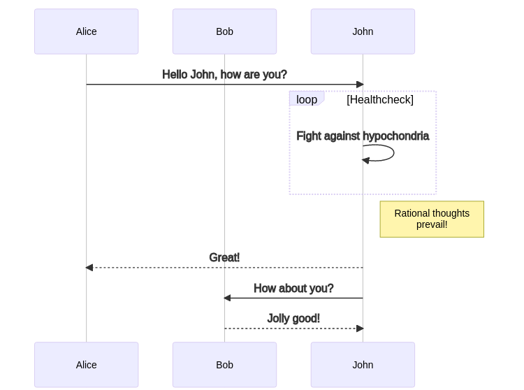

# mermaid_to_png

## Overview

Compile diagrams in the `diagrams` folder to png using the [mermaid-cli](https://github.com/mermaid-js/mermaid-cli)


## Usage

Using this mermaid template

```bash
cat ./diagrams/example.mmd
sequenceDiagram
    participant Alice
    participant Bob
    Alice->>John: Hello John, how are you?
    loop Healthcheck
        John->>John: Fight against hypochondria
    end
    Note right of John: Rational thoughts <br/>prevail!
    John-->>Alice: Great!
    John->>Bob: How about you?
    Bob-->>John: Jolly good!
```

We can compile it using the script `compile.sh`

```bash
./compile.sh
Compiling example.mmd --> example.mmd.png
```

It render the following png image


